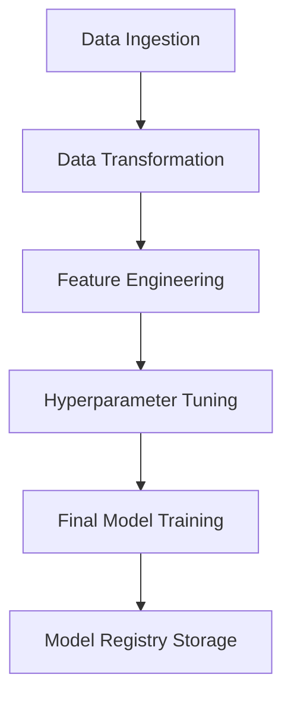
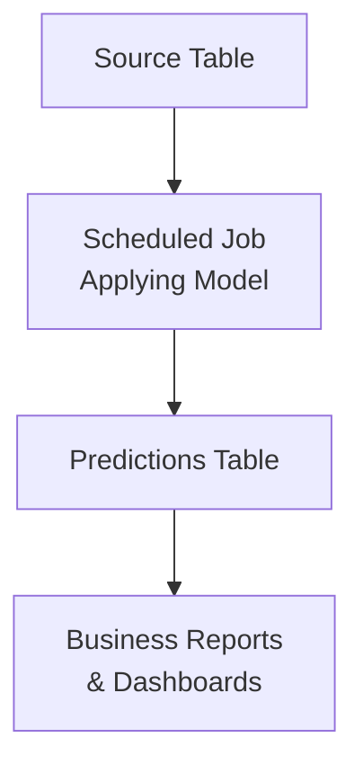
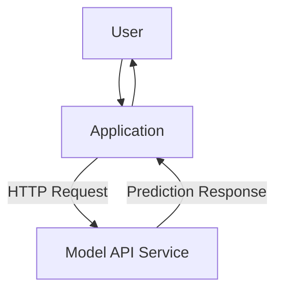
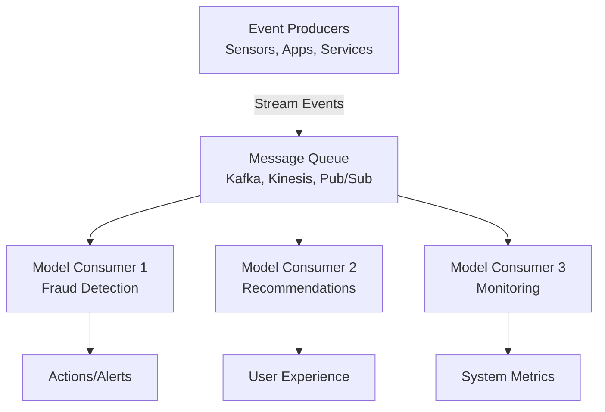

# MLOps Study Notes

## Overview
Studies related to MLOps to support initiatives at B Lab and personal projects.

**Learning Resource:** [MLOps Zoomcamp](https://github.com/DataTalksClub/mlops-zoomcamp)

## Core MLOps Process

The fundamental MLOps workflow follows three main phases:
**Design → Train → Operate**

- **Deployment Method:** APIs serve as the primary deployment mechanism
- **Integration:** Applications connect to these APIs for model inference
- **Definition:** MLOps is a set of practices that integrate ML models into production systems, ensuring they can be retrained automatically and their quality continuously monitored

## Development Environment Setup

### GitHub Codespaces Configuration
1. Create a new repository
2. Click "Code" button (same location as clone link)
3. Select "Create Codespaces on Main"
4. Install VS Code extension for enhanced local development

## MLOps Maturity Model

### Level 0: No MLOps
- **Characteristics:** Experimental phase with Jupyter notebooks
- **Limitations:** No tracking, no automation
- **Use Case:** Proof of concepts (POCs)
- **Next Step:** Validate model effectiveness before advancing

### Level 1: DevOps, No MLOps
- **Engineering Practices:** Automated releases, unit testing, CI/CD, operational metrics
- **ML Limitations:** No experiment tracking, no reproducibility, data science team isolated from engineering
- **Scenario:** First-time model deployment to production

### Level 2: Automated Training
- **Key Features:**
  - Automated training pipelines
  - Experiment tracking systems
  - Model registry with versioning
  - Low-friction deployment processes
  - Data science and engineering collaboration
- **Recommended For:** Organizations with multiple models in production

### Level 3: Automated Deployment
- **Advanced Capabilities:**
  - Streamlined model deployment
  - A/B testing for model versions
  - Comprehensive model monitoring
- **Ideal For:** 4-6 models in production OR one business-critical model

### Level 4: Full MLOps Automation
- **Complete Automation:** Self-healing systems that automatically retrain and deploy models
- **Features:** Fault prevention, comprehensive monitoring, zero human intervention
- **Target:** Organizations with mature ML operations at scale

## Experiment Tracking

### Core Concepts
- **ML Experiment:** Complete model development process
- **Experiment Run:** Individual trial within an experiment
- **Run Artifact:** Files associated with specific runs
- **Experiment Metadata:** Contextual information about experiments

### Tracking Components
Essential elements to track for each experiment:
- Source code and version
- Environment configuration
- Training data
- Model architecture
- Hyperparameters
- Performance metrics

### Benefits
- **Reproducibility:** Ability to recreate exact experimental conditions
- **Organization:** Structured approach to experiment management
- **Optimization:** Data-driven model improvement

## MLFlow Implementation

### Platform Overview
Open-source machine learning lifecycle management platform with four core components:
1. **Tracking:** Experiment logging and comparison
2. **Models:** Model packaging and serving
3. **Model Registry:** Centralized model versioning
4. **Projects:** Reproducible ML code packaging

### Installation and Setup

#### Basic Installation
```bash
pip install mlflow
```

#### Local Server with Persistence
```bash
mlflow ui --backend-store-uri sqlite:///mlflow.db --default-artifact-root ./artifacts
```

#### Python Configuration
```python
import mlflow

# Configure tracking database
mlflow.set_tracking_uri("sqlite:///mlflow.db")
mlflow.set_experiment("nyc-taxi-experiment")
```

### Model Management
Version control and lineage tracking for ML models.

#### Model Logging Example
```python
# Log trained model as artifact
mlflow.xgboost.log_model(booster)
```

**Note:** The `--default-artifact-root ./artifacts` parameter specifies local storage location for model artifacts.

## Model Registry

### Beyond Version Control
The model registry addresses critical production concerns:
- **Change Documentation:** What modifications were made between versions?
- **Configuration Management:** Should production hyperparameters be updated?
- **Preprocessing Requirements:** What data transformations are needed?
- **Environment Specifications:** Dependencies, library versions, runtime requirements
- **Rollback Capability:** Quick reversion to previous stable versions

### Key Benefits
- **Improved Versioning:** Comprehensive model lifecycle tracking
- **Enhanced Communication:** Better collaboration between data scientists and deployment teams
- **Model Lineage:** Clear history of model evolution
- **Stage Management:** Organized promotion through staging, production phases

## MLFlow Deployment Strategies

### Scenario-Based Recommendations

#### Individual Development
**Setup:** Local MLFlow UI
```bash
mlflow ui
```
**Use Case:** Solo projects without production deployment needs

#### Small Team Collaboration
**Setup:** Local MLFlow server with persistence
```bash
mlflow server --backend-store-uri sqlite:///mlflow.db --default-artifact-root=s3://{mlflow-artifacts}/
```
**Use Case:** Cross-functional team with single ML practitioner

#### Enterprise Multi-Team Environment
**Architecture Components:**
- **Tracking Server:** EC2 instance
- **Backend Store:** PostgreSQL database
- **Artifact Store:** S3 bucket
- **Considerations:** Security, scalability, team isolation

### Configuration Options

| Component | Local Option | Remote Option |
|-----------|-------------|---------------|
| Backend Store | SQLite | PostgreSQL |
| Artifact Storage | Local filesystem | S3 |
| Tracking Server | localhost | Remote server |

## ML Pipeline Architecture

### Pipeline Overview
A systematic approach to creating reproducible, parameterized ML workflows.



### Pipeline Stages Detailed

1. **Data Ingestion:** Raw data collection and initial loading
2. **Data Transformation:** Filtering, outlier removal, data cleaning
3. **Feature Engineering:** Vectorization, feature matrix creation (X, y)
4. **Hyperparameter Tuning:** Optimization of model parameters
5. **Final Model Training:** Training with optimal parameters and full dataset
6. **Model Registry Storage:** Versioned model storage for production use

### Implementation Strategy
**Development Path:** Jupyter Notebook → Python modules → Production pipeline

**Code Organization:** Transform experimental code into maintainable functions with clear interfaces

## Workflow Orchestration

### Orchestration Tools

#### General Purpose Platforms
- **Airflow:** Mature, feature-rich workflow management
- **Prefect:** Modern, Python-native orchestration
- **Mage:** Data pipeline tool with ML focus
- **Dagster:** Asset-oriented data orchestration

#### ML-Specific Platforms
- **Kubeflow:** Kubernetes-native ML workflows
- **MLflow:** End-to-end ML lifecycle management

### Orchestration Benefits
- **Centralized Management:** Single point of control for all workflows
- **Scheduling:** Automated execution based on time or events
- **Monitoring:** Real-time pipeline health and performance tracking
- **Alerting:** Proactive notification of failures or issues
- **Maintainability:** Structured, version-controlled workflow definitions

## Model Deployment

### Deployment Context
Following the core MLOps process: **Design → Train → Operate**

After designing the solution and validating that ML is the appropriate approach, and after training a model successfully, the final phase is to operate it in production. Model deployment is the primary output of this operational phase.

### Deployment Patterns

#### 1. Batch Processing
**Use Case:** Predictions can tolerate latency (hours to days)
**Examples:** Churn prediction models, monthly reporting, periodic risk assessments
**Execution:** Scheduled jobs running at regular intervals



**Characteristics:**
- High throughput processing
- Cost-effective for large datasets
- Suitable for non-time-critical predictions
- Can leverage distributed computing resources efficiently

#### 2. Real-Time Serving

##### Web Service (API)
**Use Case:** On-demand predictions with immediate response requirements
**Examples:** Recommendation engines, fraud detection, personalization
**Architecture:** RESTful APIs or GraphQL endpoints



**Characteristics:**
- Low latency (milliseconds to seconds)
- Synchronous request-response pattern
- Scalable with load balancers and auto-scaling
- Suitable for user-facing applications

##### Streaming Processing
**Use Case:** Continuous, real-time event processing
**Examples:** IoT sensor monitoring, real-time anomaly detection, live recommendation updates
**Architecture:** Event-driven systems with message queues



**Characteristics:**
- Ultra-low latency processing
- High throughput event handling
- Asynchronous processing
- Can include micro-batch processing for efficiency
- Fault-tolerant and scalable

### Deployment Decision Framework

| Factor | Batch | Web Service | Streaming |
|--------|-------|-------------|-----------|
| **Latency Requirements** | Hours to Days | Seconds | Milliseconds |
| **Volume** | High | Medium | Very High |
| **Cost** | Low | Medium | High |
| **Complexity** | Low | Medium | High |
| **Use Cases** | Reports, Analytics | User Interactions | Real-time Monitoring |

### Implementation Considerations

#### Infrastructure Requirements
- **Compute Resources:** CPU, memory, and GPU requirements based on model complexity
- **Scaling Strategy:** Horizontal vs. vertical scaling based on traffic patterns
- **Storage:** Model artifacts, feature stores, and prediction logs
- **Monitoring:** Performance metrics, model drift detection, and system health

#### Operational Concerns
- **Model Versioning:** Blue-green deployments, canary releases
- **Rollback Strategies:** Quick reversion to previous model versions
- **A/B Testing:** Comparing model performance in production
- **Security:** Authentication, authorization, and data privacy compliance

### Web-Service with Flask and Docker using MLFlow Artifacts

Deploy pickle files generated by MLflow models using Flask and Docker. Simple reproducible deployment pattern.

**Use Case:** Real-time API serving for immediate prediction requests

#### Setup Steps

1. **Create virtual environment with Pipenv**
   ```bash
   pipenv install scikit-learn==1.7.2 flask gunicorn
   pipenv install --dev requests
   ```
   
   **Note:** Match scikit-learn version with training environment to avoid compatibility issues.

2. **Create prediction script**
   - Load MLflow model artifacts (pickle files)
   - Handle feature preprocessing 
   - Return predictions
   - **File:** `web-service/predict.py`

3. **Create Flask app**
   - Wrap prediction script in Flask routes
   - Add `/predict` endpoint for main functionality
   - Add `/health` endpoint for monitoring
   - **File:** `web-service/predict.py` (can be same file)

4. **Package with Docker**
   - Create Dockerfile for containerization
   - **File:** `web-service/Dockerfile`
   
   ```bash
   # Build container
   docker build -t ride-duration-prediction-service:v1 .
   
   # Run container
   docker run -it --rm -p 9696:9696 ride-duration-prediction-service:v1
   ```

**Benefits:** 
- Scalable web service deployment
- Containerized for consistent environments
- API-based integration with applications

---

### Batch Deployment

Transform training notebooks into production batch processing scripts for scheduled predictions.

**Use Case:** Periodic predictions where latency is acceptable (hours/days)

#### Conversion Process

1. **Notebook to Script Conversion**
   - Take existing model training notebook
   - Modify for model application instead of training
   - Convert notebook cells to Python script

2. **Script Optimization**
   - Clean up experimental code
   - Add proper error handling
   - Parametrize inputs (data paths, model versions, etc.)
   - Structure for production use

3. **Implementation Considerations**
   - Schedule execution (cron jobs, orchestration tools)
   - Handle large datasets efficiently
   - Log outputs and errors
   - Integrate with data pipelines

**Benefits:**
- Cost-effective for large-scale processing
- Suitable for non-time-critical predictions
- Can leverage distributed computing resources


---

## Model Monitoring

**Why Monitor?** ML models degrade over time due to changing data patterns, concept drift, and infrastructure issues. Without monitoring, you won't know when your model stops working effectively.

### Three Pillars of ML Monitoring

#### 1. Service Health Monitoring
**What to Track:** System-level metrics that ensure your ML service is running properly
- **Uptime:** Service availability and response status
- **Memory Usage:** Resource consumption patterns
- **Latency:** Response time for predictions
- **Throughput:** Requests per second handling

**Tools:** 
- **Prometheus + Grafana:** Industry standard for infrastructure monitoring
- **DataDog, New Relic:** Alternative APM solutions

#### 2. Data Health Monitoring  
**What to Track:** Input data quality and consistency over time
- **Data Drift:** Statistical changes in input feature distributions
- **Broken Pipelines:** ETL failures or data processing errors
- **Schema Changes:** Unexpected changes in data structure/format
- **Data Outages:** Missing or incomplete data sources

**Detection Methods:**
- Statistical tests (KS test, chi-square)
- Distribution comparisons
- Data validation rules
- Pipeline status checks

#### 3. Model Health Monitoring
**What to Track:** Model performance and prediction quality
- **Model Accuracy:** Performance metrics vs. ground truth when available
- **Concept Drift:** Changes in the relationship between features and target
- **Model Bias:** Unfair treatment of different population segments  
- **Underperforming Segments:** Specific groups where model quality drops

**Monitoring Approaches:**
- **Ground Truth Comparison:** When labels are available (batch scenarios)
- **Proxy Metrics:** Business metrics that correlate with model performance
- **Model Confidence:** Prediction uncertainty tracking
- **A/B Testing:** Compare model versions in production

### Implementation Strategy

**Iterative Approach:**
1. **Start Simple:** Use existing company monitoring tools (Grafana, DataDog, etc.)
2. **Add ML-Specific Metrics:** Extend with model-focused dashboards
3. **Iterate Based on Value:** Build more sophisticated monitoring as you learn what matters

**Key Library: Evidently**
- **Purpose:** Calculate ML monitoring metrics (drift, performance, bias)
- **Integration:** Works with existing monitoring infrastructure
- **Features:** Pre-built dashboards, statistical tests, automated reports

**Example Monitoring Workflow:**
```python
# Using Evidently for drift detection
from evidently import ColumnMapping
from evidently.report import Report
from evidently.metric_preset import DataDriftPreset

# Compare current data vs. reference data
report = Report(metrics=[DataDriftPreset()])
report.run(reference_data=train_data, current_data=production_data)
```

### Monitoring Best Practices

- **Establish Baselines:** Use training data as reference for drift detection
- **Set Alerts:** Define thresholds that trigger investigation or retraining
- **Regular Reviews:** Schedule periodic model performance assessments
- **Documentation:** Track what you monitor and why (avoid monitoring everything)
- **Business Alignment:** Focus on metrics that impact business outcomes